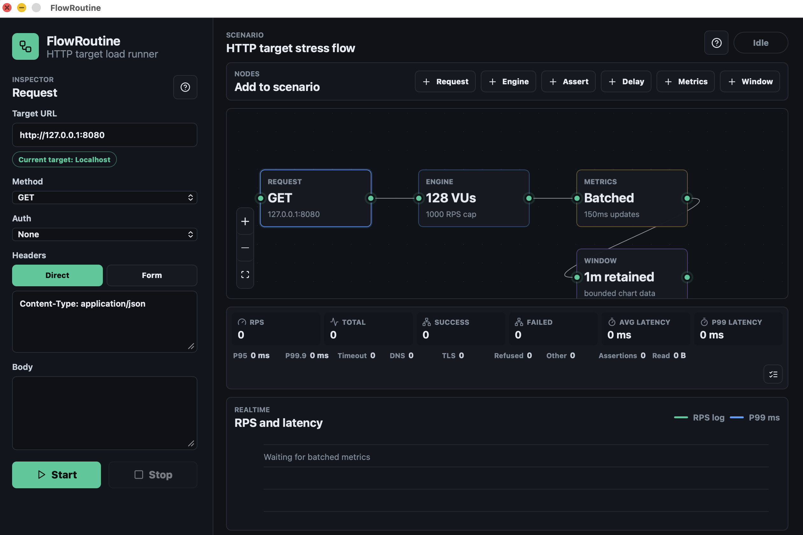

<div align="center">

# FlowRoutine

**Local-first visual load testing for HTTP APIs.**


FlowRoutine lets you compose HTTP load-test scenarios as nodes, run them locally with a Go engine, and watch realtime metrics without uploading your scenarios, targets, auth values, or metrics to a FlowRoutine cloud service.

Built with OpenAI Codex assistance.



</div>

## Why FlowRoutine

- **Visual scenario editing**: Build request, delay, assertion, engine, metrics, and chart-window nodes on a React Flow canvas.
- **Postman/OpenAPI/HAR import**: Turn Postman Collection v2 JSON files, OpenAPI or Swagger JSON/YAML endpoints, or browser HAR captures into runnable scenario nodes.
- **Stateful API flows**: Capture JSON response values and reuse them as `{{variables}}` in later request URLs, headers, or bodies.
- **Local load engine**: Run staged virtual-user or arrival-rate profiles locally with goroutines, `fasthttp`, keep-alive reuse, and pooled request/response objects.
- **Realtime feedback**: Track RPS, latency, failures, status code counts, and bounded live chart data through batched Wails events.
- **Shareable local reports**: Export completed runs as redacted JSON reports with summary metrics, error breakdowns, status codes, and timeline points.
- **SLO gates**: Configure failure-rate, latency, and RPS thresholds on the Metrics node and get pass/fail results locally or in exported k6 scripts.
- **Regression awareness**: Completed runs are compared with the previous local baseline for the same scenario to flag RPS, latency, and failure-rate changes.
- **k6 handoff**: Export visual scenarios to k6 JavaScript for CI runs or distributed execution outside the desktop app.
- **Privacy-first workflow**: Scenario data, target URLs, auth values, and metrics are handled locally instead of being uploaded to a FlowRoutine cloud service.

## Quick Start

```bash
npm --prefix frontend install
go install github.com/wailsapp/wails/v2/cmd/wails@latest
wails dev
```

Run checks:

```bash
npm --prefix frontend run build:wails
go test ./...
go build ./...
```

## Features

| Area | What works |
| --- | --- |
| Scenario canvas | Request, Engine, Metrics, Window, Delay, and Assert nodes |
| Import | OpenAPI / Swagger JSON or YAML URL import, Postman Collection v2 JSON import, and browser HAR import |
| Request setup | Method, URL, headers, body, auth helpers, JSON capture variables, and recent run loading |
| Execution | Linear path execution from Request through Engine, with Delay and typed Assert support |
| Engine | Constant/ramping VUs, constant/ramping arrival rate, graceful stop, RPS cap, timeouts, max connections, keep-alive reuse |
| Metrics | RPS, aggregate and request-step counts, latency percentiles, transport failures, typed assertion failures, dropped iterations, and HTTP status diagnostics |
| Reports | Completed-run JSON export with per-step diagnostics, SLO pass/fail, local baseline comparison, and sensitive-data redaction |
| Interop | k6 JavaScript export with thresholds and sensitive headers mapped to environment variables |
| UI | Node help, Korean/English descriptions, adjustable chart window, wheel zoom, edge deletion |

Capture syntax is `name[@iteration|run][:success|any|2xx|200]=JSON.path`. Iteration values reset on every
virtual-user loop; run values keep the first successful value for that virtual user. JSON paths support
dot segments and array indexes such as `$.items[0].token`. A missing value never sends an unresolved template.

Request, failure, byte, and status-code summaries use the final cumulative engine snapshot and remain exact.
Latency sampling selects one of every configured N iterations per worker and records every request step in that
iteration, avoiding systematic gaps in multi-request scenarios. Reports disclose total
requests, latency samples, and the effective sampled fraction. Realtime charts retain at most 2,048 lightweight
points, while exported report timelines retain at most 1,000 points. Streaming downsampling preserves the first
and last samples plus per-bucket RPS, P95, and P99 minimum and maximum excursions.

Each request node keeps a stable step ID with sharded, fixed-size latency and HTTP-status histograms. The engine
caps step-stat shards at four and scenarios at 512 steps, keeping worst-case step-metric storage below 25 MiB.
Compact cumulative step summaries are added to realtime events at most once per second and always on completion.

Assert nodes validate status codes, header presence or exact values, typed JSON-path values, response latency,
or end-to-end request-step latency. Failures are classified by assertion type. Continue records and proceeds,
Stop ends the current iteration, and Count only records the typed diagnostic without increasing enforced
assertion failures. Assertions are compiled before a run; response bodies are evaluated in place and are not
copied per virtual user.

Global request limits use one central pacer per engine run across all scenario steps. Up to 1,000 RPS it keeps
a single-permit burst and issues one permit every `1 / RPS`; higher rates are emitted in bounded 1ms batches.
Missed permits are not queued beyond one pacer tick. Saturated one-second tests allow ±20% scheduling
tolerance; longer runs converge more closely.

Execution profiles support constant VUs, ramping VU stages, constant arrival rate, and ramping arrival-rate
stages. VU targets are reconciled every 10ms and ramp-down stops new iterations while allowing active iterations
to finish within the configured graceful-stop window. After that window, context-aware work is cancelled; an
in-flight HTTP transport remains bounded by the request timeout. Arrival-rate scheduling integrates the configured
linear rate curve in 1ms buckets: by the profile deadline, attempted plus dropped iterations stays within one
iteration of the floored curve integral. Scheduler or target saturation can widen
instantaneous timing; work beyond `maxVUs` is counted as dropped instead of being queued and replayed later.

OpenAPI imports require separate consent for private-network targets, HTTP redirects, and external `$ref`
documents. Redirect and reference destinations reuse the same network policy. Imports are capped at 5 MiB
per document, 20 MiB total, 16 documents, 5 redirects, 64 reference levels, 10,000 references, and 200,000
resolved nodes; cyclic or unresolved references fail without returning the source document over the bridge.

Postman and HAR imports are capped at 5 MiB, 64 JSON nesting levels, and 500 runnable requests. Valid files
open a searchable selection preview before any graph state changes. Append inserts requests before Engine;
replace requires an explicit destructive choice. A successful import is one-step undoable, while read, parse,
validation, and graph-compilation failures leave the active graph and runtime secrets unchanged.

Engine counters use `min(VUs, 4 × GOMAXPROCS, 256)` stable stripes. Status-code and latency-histogram storage,
snapshot scans, and reset work therefore stop growing with virtual users after the CPU-scaled stripe cap.
The 1,024-bucket latency histogram has at most 1µs absolute overestimation from 0–1µs and less than 2% relative
overestimation above 1µs through the maximum 5-minute request timeout. P95 and P99 SLO checks are withheld as
`insufficient` below 20 and 100 latency samples respectively, the minimum samples needed to resolve one
observation in each percentile tail; this is a rank-resolution guard, not a statistical confidence interval.

Scenario graphs compile as one deterministic directed path in `O(nodes + edges)` time before preflight or k6
export. Multiple requests are supported on that path; cycles, disconnected components, branches, merges, and
ambiguous Engine, Metrics, or Window control nodes are rejected with node-specific errors. The resolved path is
shown above the canvas and does not depend on React node or edge array order.

Request templates are parsed into literal and variable segments during configuration compilation. Each worker
reuses one render buffer after warm-up; buffers above 64 KiB are released after the request. Static requests
continue to use their compiled byte slices directly and retain the zero-allocation acquire/release path.

### k6 export compatibility

Exports map all four execution profiles to k6's equivalent `constant-vus`, `ramping-vus`,
`constant-arrival-rate`, or `ramping-arrival-rate` executor, including stages, worker capacity, graceful stop,
request timeouts, quality thresholds, captures, typed response assertions, and stop-iteration behavior. FlowRoutine's global request cap maps to
k6's `rps` option for VU profiles so multi-request scenarios retain a
request-level limit; k6 [discourages this option](https://grafana.com/docs/k6/latest/using-k6/k6-options/reference/#rps)
and applies it once per load generator, so distributed or cloud runs multiply the effective cap. k6 also
samples every request and has no direct equivalent for FlowRoutine connection buffers or response-size limits.

## Architecture

```text
React / React Flow / Zustand
        |
        | Wails calls + batched metrics events
        v
Wails bridge
        |
        v
Go load engine
  - goroutine virtual users
  - fasthttp host clients
  - sync.Pool request/response reuse
  - sharded atomic stats
```

## Benchmark Helper

Run an embedded local loopback benchmark:

```bash
go run ./cmd/flowroutine-bench -duration 5s -warmup 1s -vus 256 -latency-sample-rate 100
```

Run against a real HTTP or HTTPS target:

```bash
go run ./cmd/flowroutine-bench -url https://example.com -duration 5s -warmup 1s -vus 256 -latency-sample-rate 100
```

Benchmark results vary by hardware, OS limits, network path, TLS cost, and target capacity. Treat local results as measurements of that environment, not universal project guarantees.

## Safety

Load testing can disrupt real services. FlowRoutine includes RPS caps, ramp-up controls, public-target warnings, and duration guardrails, but the operator is responsible for using it safely.

- Start with a small RPS cap.
- Use ramp-up.
- Keep durations short until the target behavior is understood.
- Monitor the target service and network path.
- Do not test third-party systems without explicit permission.

## Roadmap

- Add a manual scenario library with named saves beyond recent-run history.
- Support branching and multiple scenario paths.
- Improve packaged desktop builds for macOS, Windows, and Linux.

## Current Limits

- Graph execution follows one selected linear scenario path.
- Distributed load generation is not implemented.
- Auth secret values are memory-only and are not saved in recent-run history.

## License

FlowRoutine is released under the [Apache License 2.0](LICENSE).
